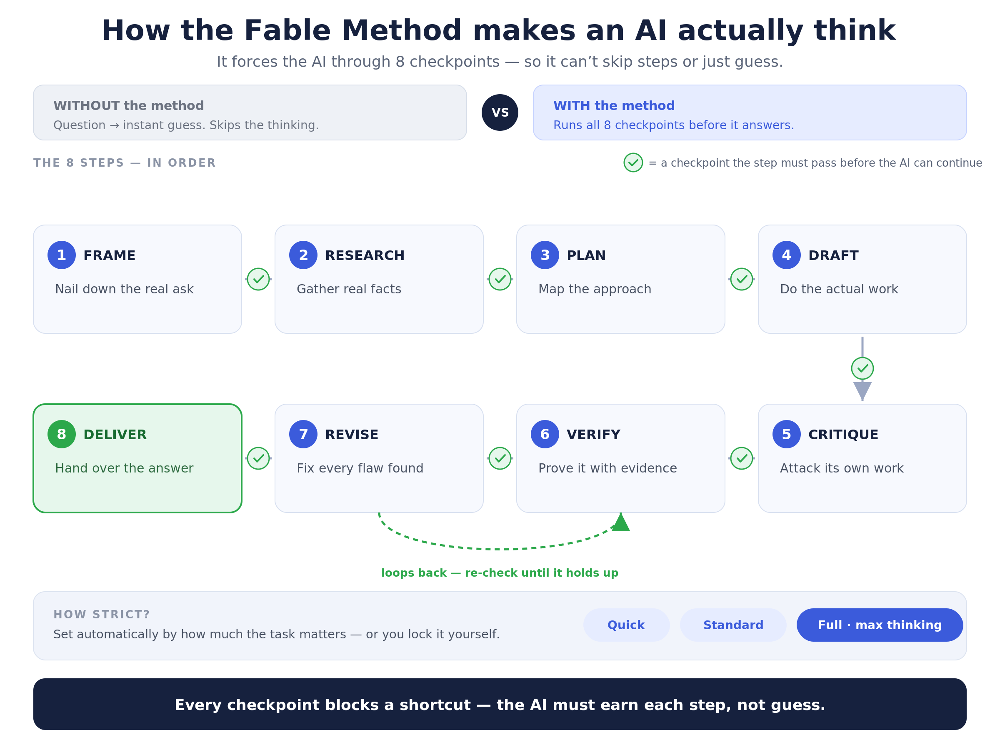

# The Local Architect

Open-source AI tools, built in public and free to use. Each tool lives in its own
folder — self-contained, with its own README and setup. Fork it, run it, build on it.

---

## Tools

### 🧠 Fable Method — [`fable-method/`](fable-method/)

**Make any AI actually think — instead of guessing.**

The Fable Method forces an AI through eight ordered, gated stages and won't let it move
to the next step until the current one passes. Effort scales to the stakes with a rigor
dial. It's model-agnostic, and the engine has **zero dependencies** beyond the Python
standard library. Use it the easy way (a drop-in "skill" — no setup), or the strict way
(an MCP server that makes skipping a step mechanically impossible).

→ Full README, the skill, and one-command setup: **[`fable-method/`](fable-method/)**

---

*More tools coming.*

## License

Each tool ships with its own license (MIT unless noted). See the tool's folder.
